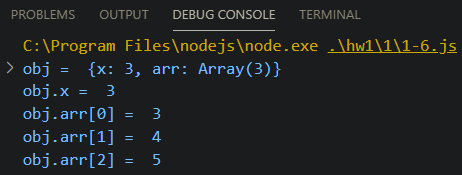

# Internet of Things

## 2020-11-29
homework 제출을 위한 repository를 생성함.

### 1-1
변수 선언에 대한 예제이므로, 실행결과는 아무 것도 출력되지 않는다.

### 1-2

변수 선언 후 값 할당, 변수 재선언.

### 1-3

변수 여러개를 선언 후 값을 변경하는 예제. 문자열은 덧셈연산자를 사용할 경우, concat 함수와 동일한 결과를 출력한다.

### 1-4

Object를 생성하여, 내부의 멤버에 데이터를 할당하는 예제.

### 1-5

Object를 생성하고, 내부의 멤버변수의 값을 변경하는 예제.

### 1-6

Object의 멤버값으로 배열을 생성하는 예제.

### 1-7

변수와 Object를 각각 생성하고 값을 할당한 후 다른 변수/Object에 해당 값을 복사하는 예제.

### 1-8

변수와 Object를 각각 생성/복사하고 값을 변경하는 예제.
일반 변수 a,b는 같은 상수 메모리를 가리키기 때문에, b가 변해도 a의 값은 변하지 않지만, 일어나지만, Object의 경우, reference memory에 대한 메모리를 가리키기 때문에 obj2의 값이 변경되면 obj1의 값도 함께 변경된다.

### 1-9

변수와 Object를 각각 생성/복사하고 값을 변경하는 예제.
예제 1-8과는 달리, 새로운 object를 생성하면서 값을 할당하였기 때문에 obj2와 obj1은 다른 메모리를 가리키게 되어 같은 값을 갖지 않는다.

### 1-10

Object를 인자로 받아들여, name에 대한 값을 변경하는 예제.
1-8과 같이 같은 메모리를 가리키게 만든 후 값을 변경하였기 때문에, user와 user2의 값이 같아진다.

### 1-11

Object를 인자로 받아들여, name에 대한 값을 변경하는 예제.
1-9과 같이 같은 메모리를 생성한 후 값을 리턴하였기 때문에, user와 user2가 다른 메모리를 가리켜 값도 달라진다.

### 1-12
Object를 인자로 받아들여, 내부의 모든 멤버변수를 copy하는 함수를 선언, (사용은 1-13에 나오므로 실행결과 생략.)

### 1-13

1-12의 함수를 사용하는 예제,
내부의 모든 멤버변수를 따로 copy하기 때문에, 가리기는 메모리가 달라져 값도 다르다.

### 1-14

Object를 복사하고, 변경하며 같은지 비교하는 예제.

### 1-15

Object를 복사하고, 변경하며 같은지 비교하는 예제.
Object안에 또 Object가 있기 때문에, copyObject를 2번함.

### 1-16
Object안에 또 다른 Object가 있을 경우 recursive call로 모두 복사하는 함수를 정의하는 예제.

### 1-17

예제 16의 함수를 사용하는 예제, 이를 응용하여, object 내부의 모든 필드를 출력하는 함수를 구현해보았습니다.

### 1-18

JSON 모듈을 사용하여 오브젝트를 복사하는 예제, 이를 활용하여 오브젝트를 print하는 예제를 구현.

### 1-19

undefined 값을 출력해보는 예제.

### 1-20

.png)

empty array와 undefined array를 출력해보는 예제
debugger for chrome으로 실행하지 않으면 console이 제대로 출력되지 않음.

### 1-21

object의 요소를 사용하여 함수를 정의하고 바로 실행하는 예제

### 1-22

변수의 타입을 확인하고, ==와 ===의 차이를 확인하는 예제.
