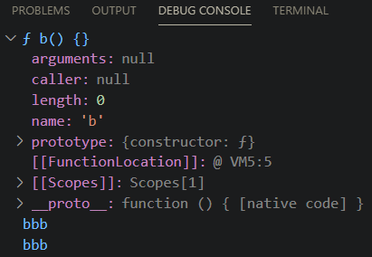
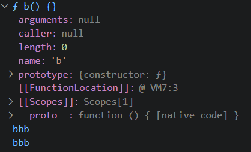
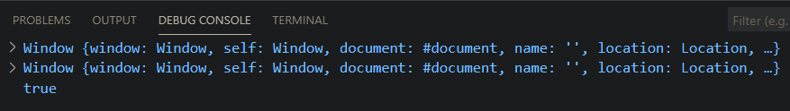
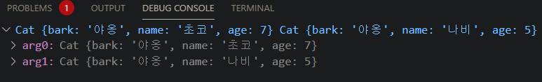

# Internet of Things

## 2020-11-29
homework 제출을 위한 repository를 생성함.

### 1-1
변수 선언에 대한 예제이므로, 실행결과는 아무 것도 출력되지 않는다.

### 1-2

변수 선언 후 값 할당, 변수 재선언.

### 1-3

변수 여러개를 선언 후 값을 변경하는 예제. 문자열은 덧셈연산자를 사용할 경우, concat 함수와 동일한 결과를 출력한다.

### 1-4

Object를 생성하여, 내부의 멤버에 데이터를 할당하는 예제.

### 1-5

Object를 생성하고, 내부의 멤버변수의 값을 변경하는 예제.

### 1-6

Object의 멤버값으로 배열을 생성하는 예제.

### 1-7

변수와 Object를 각각 생성하고 값을 할당한 후 다른 변수/Object에 해당 값을 복사하는 예제.

### 1-8

변수와 Object를 각각 생성/복사하고 값을 변경하는 예제.
일반 변수 a,b는 같은 상수 메모리를 가리키기 때문에, b가 변해도 a의 값은 변하지 않지만, 일어나지만, Object의 경우, reference memory에 대한 메모리를 가리키기 때문에 obj2의 값이 변경되면 obj1의 값도 함께 변경된다.

### 1-9

변수와 Object를 각각 생성/복사하고 값을 변경하는 예제.
예제 1-8과는 달리, 새로운 object를 생성하면서 값을 할당하였기 때문에 obj2와 obj1은 다른 메모리를 가리키게 되어 같은 값을 갖지 않는다.

### 1-10

Object를 인자로 받아들여, name에 대한 값을 변경하는 예제.
1-8과 같이 같은 메모리를 가리키게 만든 후 값을 변경하였기 때문에, user와 user2의 값이 같아진다.

### 1-11

Object를 인자로 받아들여, name에 대한 값을 변경하는 예제.
1-9과 같이 같은 메모리를 생성한 후 값을 리턴하였기 때문에, user와 user2가 다른 메모리를 가리켜 값도 달라진다.

### 1-12
Object를 인자로 받아들여, 내부의 모든 멤버변수를 copy하는 함수를 선언, (사용은 1-13에 나오므로 실행결과 생략.)

### 1-13

1-12의 함수를 사용하는 예제,
내부의 모든 멤버변수를 따로 copy하기 때문에, 가리기는 메모리가 달라져 값도 다르다.

### 1-14

Object를 복사하고, 변경하며 같은지 비교하는 예제.

### 1-15

Object를 복사하고, 변경하며 같은지 비교하는 예제.
Object안에 또 Object가 있기 때문에, copyObject를 2번함.

### 1-16
Object안에 또 다른 Object가 있을 경우 recursive call로 모두 복사하는 함수를 정의하는 예제.

### 1-17

예제 16의 함수를 사용하는 예제, 이를 응용하여, object 내부의 모든 필드를 출력하는 함수를 구현해보았습니다.

### 1-18

JSON 모듈을 사용하여 오브젝트를 복사하는 예제, 이를 활용하여 오브젝트를 print하는 예제를 구현.

### 1-19

undefined 값을 출력해보는 예제.

### 1-20

.png)

empty array와 undefined array를 출력해보는 예제
debugger for chrome으로 실행하지 않으면 console이 제대로 출력되지 않음.

### 1-21

object의 요소를 사용하여 함수를 정의하고 바로 실행하는 예제

### 1-22

변수의 타입을 확인하고, ==와 ===의 차이를 확인하는 예제.

### 2-1

inner function 과 outer function 사이의 변수의 life cycle을 확인하는 예제.

### 2-2

함수의 paramter와 함수 내부의 변수이름이 같은 경우의 동작방식에 대한 예제.

### 2-3

함수 내부에서 변숙를 여러번 정의할때의 동작방식에 대한 예제.

### 2-4

함수내부에서 x를 여러번 선언한 뒤, 값을 대입할 때의 동작방식에 대한 예제.

### 2-5

변수와 함수의 이름이 같을 때 동작과정에 대한 예제

### 2-6

변수와 함수의 이름이 같을 때 출력 후, b에 문자열 값을 저장하였을 때 동작과정에 대한 예제

### 2-7

이전 예제에서, 함수를 변수형으로 선언하여 저장한 뒤 출력해보는 예제

### 2-8

함수d를 선언하며 바로 변수 c에 담을 경우, d는 nodejs가 인식하지 못해 에러를 출력함.

### 2-9

함수표현식 변수가 사용보다 뒤에 정의되어, 에러가 발생.

### 2-10

multiply 사용 당시에는 변수만 선언되어 있기에 function이 아니라고 인식하여 에러 발생.

### 2-11

출력문은 마지막 함수를 따라가서 출력됨.

### 2-12

이전 예제와 달리, 함수가 변수 할당이기 때문에, 인식을 하지 못해 에러가 발생함.

### 2-13

inner function과 outer function의 global 변수 사용 차이에 대한 예제.

### 2-14

스코프 체인을 사용하였을 때의 동작과정에 대한 예제.

### 2-15

스코프 체인을 사용하였을 때의 동작과정에 대한 예제. inner function에서 외부의 변수를 사용하였을 때.

### 2-16

스코프 체인을 사용하였을 때의 동작과정에 대한 예제. inner function에서 외부의 변수를 사용하였을 때2.

### 3-1

전연 공간에서 this와 window의 비교.

### 3-2

전연 공간에서 this와 global의 비교. 윈도우 크롬에서는 전역공간에서 global을 인식하지 못한다.

### 3-3

전역공간에서의 변수 접근에 대한 예제. 전역공간이기 때문에 a, window.a, this.a 모두 같은 값을 출력한다.

### 3-4

전역공간에서 변수 변경에 대한 예제. 모두 같은 공간을 가리키므로, 같은 값을 출력함.

### 3-5

전역변수로 선언할 경우 삭제가 불가하지만, 전역객체 (window.c 혹은 d)로 선언할 경우 삭제가 가능함.

### 3-6

전역공간에서 함수를 사용할 경우 this는 window가 되지만, object의 멤버로 활용될 경우, this는 멤버의 이름이 됨.

### 3-7

object의 함수를 호출할 때 점(.) 이나 문자열을 포함한 대괄호로 접근하면 method로 호출됨.

### 3-8

object의 함수를 호출할 때 점(.) 이나 문자열을 포함한 대괄호로 접근하면 method로 호출됨. (inner member추가)

### 3-9

내부에서 함수의 호출 (innerFunc())로 호출할 경우 this는 호출한 객체를 명시하지 않아, window를 출력함.

### 3-10

함수정의 전, self에 this을 연결시켜 주었기 때문에, 객체를 명시하였으므로, window가 아닌 outer를 출력함.

### 3-11

arrow function을 사용하여, this를 그대로 활용 가능

### 3-12

event function을 사용하였을 때의 this 예제.

### 3-13

생성자 내부에서의 this에 대한 예제. 생성자로 호출될 경우, 할당하는 객체를 this로 가리킴

### 3-14

call method를 사용하여, this를 지정하여 넘김

### 3-15

call method를 사용하여, this를 지정하였을 때의 차이에 대한 예제, call에서 a를 지정하면 a의 값이 지정된 값으로 출력됨.

### 3-16

apply 메소드를 사용에 대한 예제. parameter를 배열로 넘김.

### 3-17

유사 배열에 push하는 예제.

### 3-18

.png)

유사배열을 잘라서 출력하는 예제